# Energy Generation Forecaster

[](https://energygenforecaster.streamlit.app/)

<p align="center">

</p>

Energy Generation Forecaster is a time series forecasting app that predicts solar energy generation potential for homeowners across all 5570 Brazilian cities based on historical solar irradiation data. This project was developed to help homeowners accurately predict the energy they could generate and the savings they could have by installing solar panels on their property.

## Features

- Predicts the solar energy generation potential for homeowners across Brazil
- Uses historical solar irradiation data from open-meteo API
- Uses IBGE Localidades API to convert lat and lon to a city's ibge code
- Uses Nominatim and OpenStreetMap API to convert an address to lat and lon
- Calculates the potential energy generated and the savings per kilowatt-hour (kWh)
- Provides monthly energy generated and savings estimates based on the user's inputs

## Getting Started

To run the app locally, please follow these steps:

1. Clone the repository

```
git clone https://github.com/olucaslopes/EnergyGenForecaster.git
```

2. Install the required packages

```
pip install -r requirements.txt
```

3. Run the app

```
streamlit run app.py
```

## How to Use

1. Type your address or change your location by clicking the `Alterar` button.

2. Enter the total area in square meters of your solar panels, the average efficiency percentage, and the average energy price per kilowatt-hour (kWh).

3. The app will automatically calculate and show the potential energy generated and savings based on the historical solar irradiation data for the selected location.

4. The monthly energy generated and savings estimates will be displayed.

## Architecture

```mermaid
flowchart TB
    subgraph one["User Input"]
    loc_input["📌 Location"]
    area_input["📐 Panel Area"]
    efic_input["💱 Panel Efficiency"]
    energy_price["💵 Energy Price"]
    end

    loc_input-- "Address" -->nominatim["📍 Nominatim OpenStreetMap API"]
    nominatim-- "Latitude and Longitude" -->ibge["🗺️ IBGE Localidades API"]
    ibge -- "City Code" --> ml["🔍 Machine Learning Model"]
    ml -- "Predicted Irradiation" --> calc["⚡ Energy"]
    area_input --> calc
    efic_input --> calc

    subgraph two["Historical Data"]
    database["🗃️ Cloud Database"]
    meteo["🌦️ OpenMeteo API"]
    meteo -- "City Irradiation Data" --> ml
    database -- "Historical Data from <br>all Cities for Training" --> ml
    end

    subgraph three["Calculations"]
    calc -- "Predicted Energy" --> savings["💲 Savings"]
    energy_price --> savings
    end

```



## APIs Used

- IBGE Localidades API: used to convert lat and lon to a city's ibge code
- Open-Meteo API: used to get the historical irradiation data for the respective city (or county)
- Nominatim and OpenStreetMap API: used to convert an address to lat and lon

## Contact

If you have any questions or suggestions, please feel free to [contact me on LinkedIn](https://www.linkedin.com/in/o-lucas-lopes).
